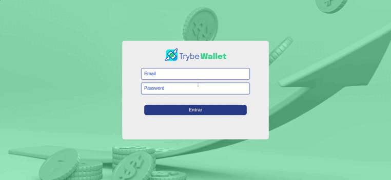
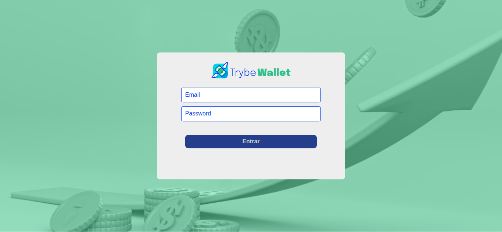
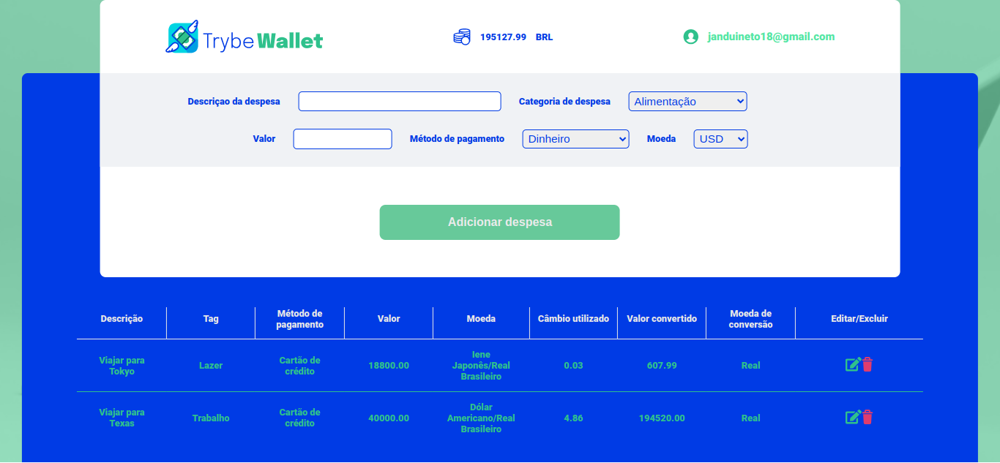

<h1>Wallet</h1> 

## 💻 Sobre o projeto

<p>
  Uma carteira de controle de gastos com conversor de moedas, utilizando React, Redux React é uma Api de <a href="https://economia.awesomeapi.com.br/json/all"> Cotações de Moedas.</a>
  Um Projeto com focor em aprimorar meus conhecimentos em Redux é React.
</p>

---


<a href="https://wallet-jrn.netlify.app/">Deploy Wallet</a>
<h2>Tenologias Ultilizadas</h2>
 <div >
 
 
 
 
 
 
 
 
<!--   -->
 </div>
 <br>
 <div align="center">
   
 </div>

### Web

<div style="display:flex; gap:1rem;">
  
  
</div>

---
 
<h3>Features</h3>

- [x] Cadastro de usuário
- [x] Cadastro de novos gastos
- [x] Ediçao de gastos ja enviados
- [x] Exclusão de gastos

---

 <h4> 
	🚧 🚀 Em construção...  🚧
</h4>
<p>Ainda Busco fazer melhorias nesta aplicação, caso tenho algo que possa melhorar não deixe de comentar em que posso melhorar.</p>


#### 🧭 Rodando a aplicação web (Frontend)

```bash

# Clone este repositório
$ git clone git@github.com:jandui-Rodrigues/Wallet.git

# Vá para a pasta da aplicação Front End
$ cd Wallet

# Instale as dependências
$ npm install

# Execute a aplicação em modo de desenvolvimento
$ npm run start

# A aplicação será aberta na porta:3000 - acesse http://localhost:3000

```
---

## 📝 Licença

Este projeto esta sobe a licença [MIT](./LICENSE).

Feito com ❤️ por Jandui Rodrigues neto 👋🏽 [Entre em contato!](https://linkedin.com/in/dev-jandui-rodrigues/)

---
 
